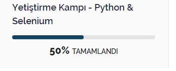

# Kodlama IO Pyhton Selenium Kampı Hafta 1 Ödev 1

## _Python Veri Tipleri_ 

- - -
**Metin Tipleri**

**String:** Karakter dizilerinden oluşan veri tipidir. 

 ```python
 name = "berkan"
 ```

 - - -

**Sayısal Tipler**

**İnteger:** Pozitif veya negatif tamsayılardır.

```python
a = 5
 ```

**Float:**  Küsüratlı basamağa sahip negatif veya pozitif sayılardır.

````python
b = 46.53
 ````

**Complex:**   j harfiyle sanal kısmı belirtebileceğimiz sayılardır.

 ```python
 c = 3j
  ```
 _ _ _

**Dizi Tipleri**

**list:** Sıralanabilen ve değiştirelebilen elemanlardan oluşan dizidir.

```python
list = ["Ankara","İstanbul","Kayseri"]
```

**tuple:** Sıralanabilen ama değiştiremeyen elemanlardan oluşan dizidir.

```python
tuple = ("elma","armut","çilek")
```
_ _ _

**Adresleme Tipleri**

**dict:**  Değiştirilebilen,indekslenebilen ama sıralanamayan elemanlardan oluşur.

```python
dict = {
         "marka" : "BMW",
         "model" : "i8",
         "yil"   : 2019
         }
```

_ _ _

**Küme Tipleri**

**set:** Sıralanamayan ve indekslenemyen elemanlardan oluşur.

```python
kume = {"elma","armut","çilek"}

kume = set()

kume = set(("Ankara","İstanbul","Kayseri"))
```
_ _ _
**Mantıksal Tipler**

**bool:** Sonucunda True veya False döndüren veri tipidir.

```python
a = bool(True)

b = bool(False)
```
_ _ _

## _Kodlama.io sitesinde değişken olarak kullanıldığını düşündüğünüz verileri, veri tipleriyle birlikte örneklendiriniz._
_ _ _

<br>
 


```python

name:"Yetistirme Kampı-Python & Selenium",     //String
completionRate:50      //Integer

```
_ _ _

## _Kodlama.io sitesinde şart blokları kullanıldığını düşündüğünüz kısımları örneklendiriniz ve Python dilinde bu örnekleri koda dökünüz._
 _ _ _

 Siteye giriş ekranında email validasyon kısmında şartlı ifadeler kullanılmış olabilir. 

 ```python
 users = [
    {'email': 'user1@example.com', 'password': 'T8s$mzV7#F2t'},
    {'email': 'user2@example.com', 'password': 'Q^#sN7jLxhC4'},
    {'email': 'user3@example.com', 'password': '3bq^4y*PmV7F'},
    {'email': 'user4@example.com', 'password': 'HkS9#jXmzN6p'},
    {'email': 'user5@example.com', 'password': 'G5@6yNwDkP#q'},
]

email = input("E-posta adresinizi girin: ")
password = input("Şifrenizi girin: ")

for user in users:
    if user['email'] == email and user['password'] == password:
        print("Giriş Başarılı")
        break
else:
    print("Kullanıcı adı veya parola hatalı")

 ```


